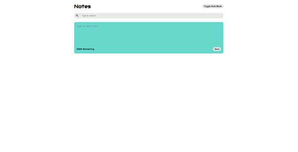
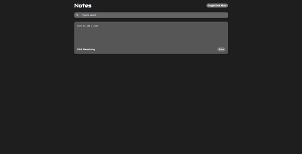
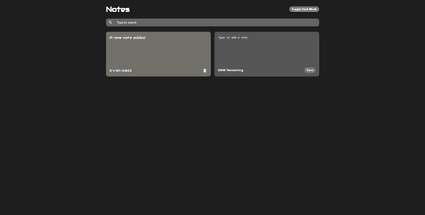

# Notes App

## Description

This is a simple React based note app that allows the user to create and manage their notes conveniently. It's a simple and efficient tool designed to help the user keep track of their thoughts, ideas, and important information.

## Features

- Adding notes: allows the user to write down a note and create it
- Dark mode toggle: allows the user to switch between dark or light mode
- Storing notes: the app uses [local storage](https://developer.mozilla.org/en-US/docs/Web/API/Window/localStorage) to store the list of notes the user created, as well as the dark mode status
- Searching notes: searches for a specific note by entering a keyword contained in that specific note
- Deleting note: deletes the selected note from the note list
- Responsive design to adapt to different screen sizes

## Live demo

You can try out the Note App by visiting the [live demo](https://zack1808.github.io/note-app)

## How to run the app

If you want to run the app localy:

#### 1. Clone the repository

- HTTPS: `git clone https://github.com/Zack1808/note-app.git`
- SSH: `git clone git@github.com:Zack1808/note-app.git`
- GitHub CLI: `gh repo clone Zack1808/note-app`

#### 2. Enter the project directory

`cd note-app`

#### 3. Allow the app to install the necessary packages (Node.js has to be installed on the device)

`npm install`

#### 4. Start the app

`npm start`

After execution, the localhost server will startup and a browser window will open, previewing the note app.

## Contributions

Contributions to the Note project are welcome. If you find any issues or want to add new features, feel free to create a pull request. Make sure to follow the project's coding conventions and provide detailed information about your changes.

## Contact

If you have any questions or suggestions, you can reach me via:

- Mail: jeanpierrenovak23@gmail.com
- My portfolio: [jeanpierrenovak.netlify.app](https://jeanpierrenovak.netlify.app)

---

Happy note-taking!
